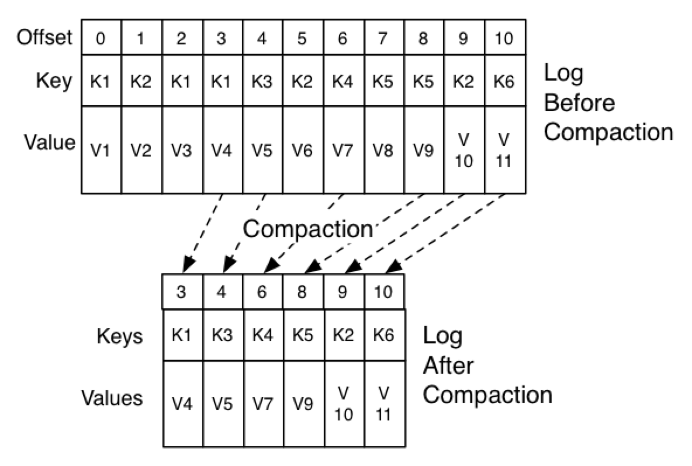

# kafka的数据过期清理策略和配置

Kafka中对过期数据的清理策略有两种，分别是`delete`或者`compact`，通过对topic的`cleanup.policy`, 或者broker的`log.cleanup.policy`来进行设置，比如从topic端来设置，如下：

```shell
> bin/kafka-topics.sh --bootstrap-server localhost:9092 \
                      --create \
                      --topic my-topic \
                      --partitions 1 \
                      --replication-factor 1 \
                      --config cleanup.policy=delete
```

或者在服务端的`server.properties`中进行如下设置：

```properties
log.cleanup.policy=compact
# 这里需要注意的是：如果从broker服务端来设置这个配置的话，那么影响的将是所有的topic
```

`delete`和`compact`这两种cleanup数据的策略是有一些区别的。

### delete策略

如果是delete策略，那么kafka直接根据一些`配置选项`将过期的数据进行删除。通常的的选项如下：

```properties
# 超过多长时间对过期数据进行删除，默认7天
retention.ms=604800000

#超过多大数据量kafka会对一个partition的数据进行数据删除，默认是-1，表示没有上限。需要注意的是这个选项是针对的一个partition，所以如果需要控制一个topic的数据量上限的话，需要用这个选项的值乘以partition数。
retention.bytes=-1 
```


### compact策略

如果topic的cleanup策略是compact策略，那么kafka对该topic的cleanup策略就不是直接对过期数据进行直接删除，而是会进行日志文件的compaction。这里的compaction，其核心概念其实是对K-V的数据的多个版本的更新信息进行清理，而只保存Key的最后一个版本的值。这种情况下可以将kafka topic中的数据视为是对数据本身的changelog。

打个比方，比如一个topic中存储的是用户的email地址，key是用户的ID，value是用户的email地址，那么，当某个用户对其email地址进行更新的时候，每次更新就会产生一条新的kafka数据，这条数据实际上是一条changelog，记录了当时时间点这用户的email信息的最新值，但当后续该用户继续对其email进行修改的话，又会产生一条新的changelog，记录其最新数据。所以当kafka对该topic进行cleanup的时候，其cleanup的方式是：对每个key只保留其最新数据，而清理掉那些历史版本。这样topic log中就只记录了某个时间点数据的最新状态，而清理掉其演变成这个状态的整个过程（如下图所示）。这样当应用程序因为某些原因需要重新拉数据，或者bootstrap的时候，就可以从这个状态进行恢复，而不用从头开始还原整个过程，会快很多。



* compact策略的执行有如下保证：

  * 消费者的消费速度如果能够跟上写入速度，那么其消费到的所有message都跟正常的message没有区别，每一条message都会有连续的offset。写入topic partition的message都将会在log中保存一定的时间，然后才可能会被compaction 线程给合并。其中``min.compaction.lag.ms`` 和`max.compaction.lag.ms`分别定义了最少多长时间（默认为0，表示随时有可能被compacted）后message才会被compacted，和在compacted之前最多在log中保存多长时间（默认永久）。
  * log中的messages的顺序永远保持不变，compaction不会对messages的顺序进行破坏，只会删除messages。
  * messages在log中的offset永远不会变，都是在写入的时候就已经固定，compaction不会改变offset的值，只会令log中被compacted的部分的offset变得不连续。

  * 消费者至少能够确保消费到数据的最终状态（到目前为止的），并且是确保以这些messages被写入的顺序。另外

### cleaner

kafka服务端内（Broker）有一个cleaner线程池（一个或多个线程），会不断的对topics进行相应的数据的clean策略的执行。cleaner有如下配置可以对其进行控制：

```properties
#这个选项默认是开启的(true)，如果关闭那么对于cleanup.policy=compact的topic将无法进行日志过期清理和合并，会导致数据不断的增长，知道达到服务器存储上限
log.cleaner.enable=true  

# broker中的cleaner线程数，默认是1
log.cleaner.threads=1

# 以下这些选项及其默认值除非必要一般无需修改
log.cleaner.backoff.ms=15000
log.cleaner.dedupe.buffer.size=134217728
log.cleaner.delete.retention.ms=86400000 （1天）
log.cleaner.io.buffer.load.factor=0.9
log.cleaner.io.buffer.size=524288
log.cleaner.io.max.bytes.per.second=1.7976931348623157E308
log.cleaner.max.compaction.lag.ms=9223372036854775807
log.cleaner.min.cleanable.ratio=0.5
log.cleaner.min.compaction.lag.ms=0
```

每一个compactor线程个工作流程如下「

1. 选择具有 highest ratio of log head to log tail的日志文件
2. 为日志文件中的每个key创建了最后一个偏移量的简要摘要
3. 从日志的开头开始一直到结尾，对每一个key的比最后出现时间要早的其他记录进行清除，并写入到新的segments文件。
4. log head的summary实际上只是一个紧凑的哈希表。 每个条目恰好使用24个字节。 使用8GB的清理器缓冲区，一次清理器迭代可以清理大约366GB的log head（假设有1000条消息）。


